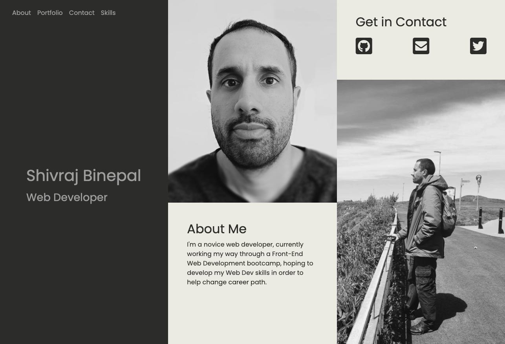
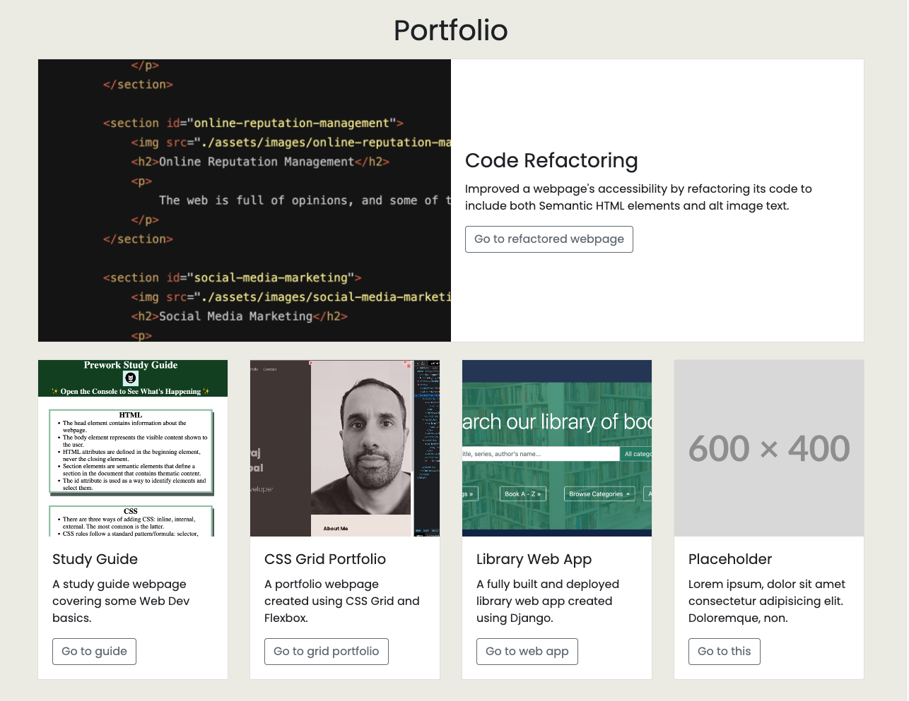
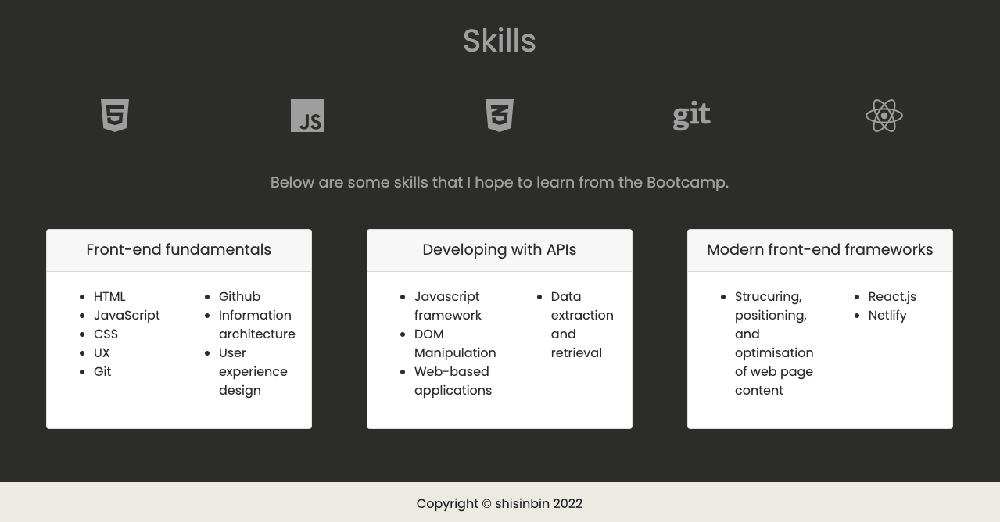
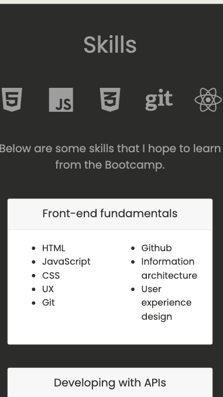

# Unit 3 Challenge: Bootstrap portfolio

## Description

A Bootstrap-powered portfolio webpage including information about myself, the pages/apps I've built so far, and the skills I hope to learn in a bootcamp.

The intention behind the webpage is to showcase my "Web Dev" skills, particularly how the CSS framework Bootstrap can be used to help build responsive webpages quickly.

In working on this portfolio, I practised and developed my skills with using Bootstrap, and improved my understanding of how fonts and icons can be imported and used.

## Installation

N/A

## Usage

This webpage can be accessed and viewed through a web browser at the address below.

https://shisinbin.github.io/bootstrap-portfolio/

Included on the webpage are links that take the user to the appropriate place. The website should be responsive to differently sized screens. Screenshots of how it should look on a desktop and on mobile are shown below.

## Credits

N/A

## License

Licensed under the [MIT](https://opensource.org/licenses/MIT) license.

## Badges

